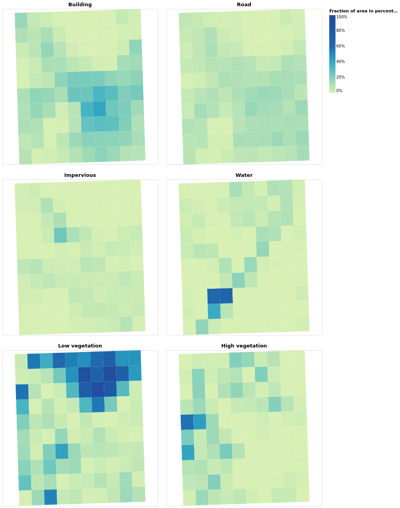

# Demat


Demat is a French Brittany word to said Hello (http://devri.bzh/dictionnaire/d/demat/).

Demat is a java library to generate [Vega-lite](https://vega.github.io/vega-lite/) representations.


Demat is under active development, nothing is stable ;-)


# Use it

The following code : 
```java
import  static org.orbisgis.demat.Demat.*;

View view = view().description("A simple bar chart").name("A simple name")
                .data(new Object[][]{{"a", "b", "c"}, {1, 22, 12}, {200, 300, 400}})
                .mark_bar()
                .encoding(x("a").nominal(), y("b").quantitative());
view.show();

```

shows https://vega.github.io/vega-lite/examples/bar.html


You are welcome to create more advanced visualization as Vega-Lite offers.


```java
import  static org.orbisgis.demat.Demat.*;
//Read the geojson file
LinkedHashMap<Object, Object> geojson = (LinkedHashMap<Object, Object>) Read.json("grid_indicators.geojson"));
List features = (List) geojson.get("features");
//Define a map with intervals
Scale scale = new Scale();
Domain domain = new Domain();
domain.values = new Double[]{0d, 0.1, 0.2, 0.3, 0.4, 0.5, 0.6, 1d};
scale.setDomain(domain);
//Use this projection to display in carthesian units
Projection projection = new Projection();
projection.setType(ProjectionType.IDENTITY);
projection.setReflectY(true);
//Create the legend
Legend legend = new Legend();
legend.setFormat("%");
legend.setTitle("Fraction of area in percentage");
//Let's create a default color
Color color = color("properties.BUILDING_FRACTION").quantitative();
color.setScale(scale);
color.setLegend(legend);
//Init the main view
View view = view().data(features).description("A Map with unique values");
//Create a view for each variable we want to renderer ROAD_FRACTION, IMPERVIOUS_FRACTION...
View map1  = view().height(400).width(400).mark_geoshape().
encoding(color).title("Building").projection(projection);
Color color2 = color.copy();
color2.setField("properties.ROAD_FRACTION");
View map2  = view().height(400).width(400).mark_geoshape().
encoding(color2).title("Road").projection(projection);
Color color3 = color.copy();
color3.setField("properties.IMPERVIOUS_FRACTION");
View map3  = view().height(400).width(400).mark_geoshape().
encoding(color3).title("Impervious").projection(projection);
Color color4 = color.copy();
color4.setField("properties.WATER_FRACTION");
View map4  = view().height(400).width(400).mark_geoshape().
encoding(color4).title("Water").projection(projection);
Color color5 = color.copy();
color5.setField("properties.LOW_VEGETATION_FRACTION");
View map5  = view().height(400).width(400).mark_geoshape().
encoding(color5).title("Low vegetation").projection(projection);
Color color6 = color.copy();
color6.setField("properties.HIGH_VEGETATION_FRACTION");
View map6  = view().height(400).width(400).mark_geoshape().
encoding(color6).title("High vegetation").projection(projection);
//Concat the view
view.concat(2, map1,map2, map3, map4,map5,map6);
//Show the result in the local browser
view.show();
```



